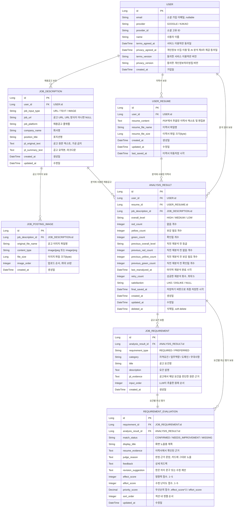

## v7 반영 요약

- 최초 가입 약관 동의를 위해 `USER`에 `terms_agreed_at`, `privacy_agreed_at`, 약관 버전 컬럼을 추가했습니다.
- 이력서 자동저장은 `USER_RESUME.last_saved_at`에서 관리하고, 최종 저장 버튼은 `ANALYSIS_RESULT.final_saved_at`에서 분리해 관리합니다.
- 공고 입력 방식이 `URL / TEXT / IMAGE`로 확장되므로 `JOB_DESCRIPTION.job_input_type`을 추가했습니다.
- 결과 화면의 원본/요약 탭을 위해 `JOB_DESCRIPTION`에 `jd_original_text`와 `jd_summary_text`를 분리했습니다.
- 공고 이미지 업로드 최대 10장 요구사항을 위해 `JOB_POSTING_IMAGE` 테이블을 추가했습니다.
- 필수/우대 섹션 분리를 위해 `JOB_REQUIREMENT.requirement_type`을 추가했습니다.
- LLM2 판정 근거 노출을 위해 `JOB_REQUIREMENT.jd_evidence`, `REQUIREMENT_EVALUATION.resume_evidence`, `judge_reason`을 분리했습니다.
- LLM3 우선순위 정렬을 위해 `effect_score`, `effort_score`, `priority_score`, `sort_order`를 `REQUIREMENT_EVALUATION`에 추가했습니다.
- 재분석은 공고 요건을 고정하고 최신 평가만 갱신하는 구조로 보고, `JOB_REQUIREMENT`는 고정 요건, `REQUIREMENT_EVALUATION`은 최신 매칭 결과로 분리했습니다.
- 최근 재분석 변화 배너를 위해 `ANALYSIS_RESULT`에 `previous_overall_level`, `previous_red_count`, `previous_yellow_count`, `previous_green_count`, `last_reanalyzed_at`을 추가했습니다.
- 회원 탈퇴는 `USER` 기준 관련 데이터 삭제가 필요하므로 FK cascade 또는 서비스 레벨 일괄 삭제 정책이 필요합니다.

## 재분석 변화 배너 저장 방식

- 변화 배너는 전체 재분석 이력이 아니라 가장 최근 재분석 1회만 보여주는 전제로 설계했습니다.
- 재분석 성공 직전에 현재 `overall_level`, `red_count`, `yellow_count`, `green_count`를 `previous_*` 컬럼에 복사합니다.
- 새 재분석 결과를 현재 `overall_level`, `red_count`, `yellow_count`, `green_count`에 저장합니다.
- `retry_count`를 1 증가시키고 `last_reanalyzed_at`을 갱신합니다.
- API 응답은 `previous_*`와 현재 값을 함께 내려주면 프론트에서 `등급 상승`, `미충족 2→0`, `보강 필요 3→1`, `충족 5→9` 같은 문구를 만들 수 있습니다.
- 과거 재분석 이력 전체가 필요해지면 `ANALYSIS_REANALYSIS_HISTORY` 같은 별도 히스토리 테이블을 추가하는 방향으로 확장합니다.
