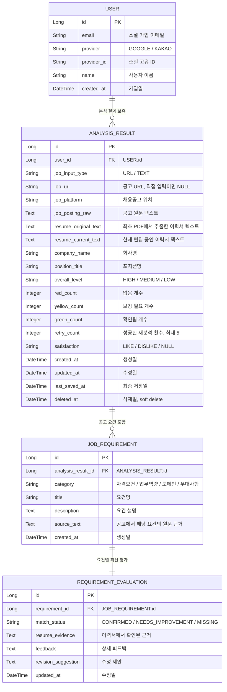

```mermaid
erDiagram
    USER {
        Long id PK
        String email "소셜 가입 이메일"
        String provider "GOOGLE / KAKAO"
        String provider_id "소셜 고유 ID"
        String name "사용자 이름"
        DateTime created_at "가입일"
    }

    ANALYSIS_RESULT {
        Long id PK
        Long user_id FK "USER.id"

        String job_input_type "URL / TEXT"
        String job_url "공고 URL, 직접 입력이면 NULL"
        String job_platform "채용공고 위치"
        Text job_posting_raw "공고 원문 텍스트"
        Text resume_original_text "최초 PDF에서 추출한 이력서 텍스트"
        Text resume_current_text "현재 편집 중인 이력서 텍스트"

        String company_name "회사명"
        String position_title "포지션명"

        String overall_level "HIGH / MEDIUM / LOW"
        Integer red_count "없음 개수"
        Integer yellow_count "보강 필요 개수"
        Integer green_count "확인됨 개수"

        Integer retry_count "성공한 재분석 횟수, 최대 5"
        String satisfaction "LIKE / DISLIKE / NULL"

        DateTime created_at "생성일"
        DateTime updated_at "수정일"
        DateTime last_saved_at "최종 저장일"
        DateTime deleted_at "삭제일, soft delete"
    }

    JOB_REQUIREMENT {
        Long id PK
        Long analysis_result_id FK "ANALYSIS_RESULT.id"

        String category "자격요건 / 업무역량 / 도메인 / 우대사항"
        String title "요건명"
        Text description "요건 설명"
        Text source_text "공고에서 해당 요건의 원문 근거"

        DateTime created_at "생성일"
    }

    REQUIREMENT_EVALUATION {
        Long id PK
        Long requirement_id FK "JOB_REQUIREMENT.id"

        String match_status "CONFIRMED / NEEDS_IMPROVEMENT / MISSING"
        Text resume_evidence "이력서에서 확인된 근거"
        Text feedback "상세 피드백"
        Text revision_suggestion "수정 제안"

        DateTime updated_at "수정일"
    }

    USER ||--o{ ANALYSIS_RESULT : "분석 결과 보유"
    ANALYSIS_RESULT ||--o{ JOB_REQUIREMENT : "공고 요건 포함"
    JOB_REQUIREMENT ||--|| REQUIREMENT_EVALUATION : "요건별 최신 평가"
    
    
```